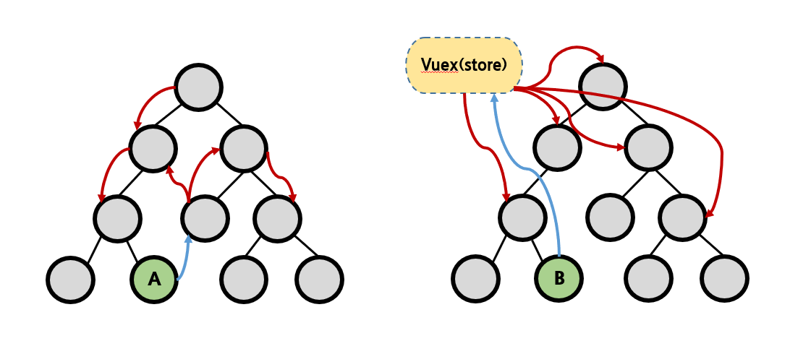
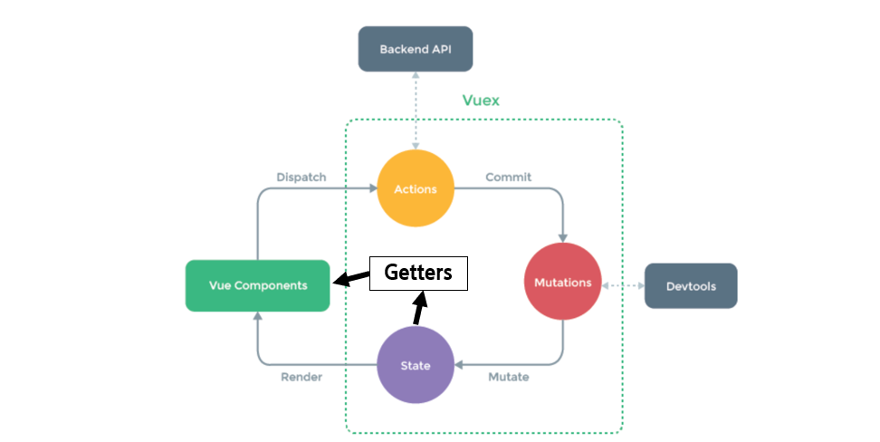

# 00_Vuex

> 2020.11.13 오전 라이브


## 1. Vuex

### 1.1. 단방향 데이터 흐름

Vue.js에서 데이터 관리의 기본 컨셉은 부모에서 자식으로 흐르는 '단방향'이다. 

- 데이터의 흐름을 명확하게 파악할 수 있고 이를 제어하기 쉬워진다. 
- 이때 각 컴포넌트에서 공유하는 데이터의 상태는 어떤 컴포넌트에서 변경되더라도 동일한 상태를 가져야한다. 
- 상태를 동기화하기 위해 데이터를 위 & 아래로 전달하는 과정에서 반복적인 코드와 복잡하고 불필요한 로직이  발생한다.


### 1.2. 중앙 (집중) 저장소 

컴포넌트가 많고 컴포넌트간 공유하는 상태 정보가 많아지는 경우 이를 중앙에서 관리하도록 한다.

- 각 컴포넌트 별로 상태 정보를 하나하나 동기화 시킬 필요가 없다.
- Store에 저장된 상태 정보가 업데이트되면 이를 공유하는 모든 컴포넌트는 알아서 이 변경 사항을 감지하고 반영한다.
- 더 이상 데이터를 컴포넌트 내부에서 관리해야 하는 불편함이 사라진다.




## 2. Vuex Core Concept

> "Vuex는 무조건 도입하는 것이 아닌 필요한 순간에 적절한 판단을 통해 결정해야 한다."




1. `State`

   https://vuex.vuejs.org/kr/guide/state.html

   - `Mutations`에 정의된 메서드에 의해 변경
   - 중앙에서 관리하는 모든 상태 정보 즉, data를 의미한다.
   - '중앙 집중식 관리'라는 건 Vue.js로 만든 서비스에 내부에 존재하는 모든 상태를 '한 곳'에 모아서 관리하는 것을 의미한다.
   - 이전의 방식은 state를 찾기 위해 각 컴포넌트를 하나 하나 살펴봐야 했다면, Vuex를 활용하는 방식은 Store에서 관리하는 데이터에를 통해 state를 한 눈에 파악할 수 있다.
   - (그리고 여전히) state가 변화하면 해당 state 정보를 공유한 컴포넌트의 DOM은 Re-rendering된다.

2. `Vue Components`

   - Vuex Store에서 state 정보를 가져와 사용한다.
   - *Dispatch를 사용해 Actions를 호출한다.*

3. `Actions`

   https://vuex.vuejs.org/kr/guide/actions.html

   - *Vue Components에서 `dispatch`메서드에 의해 호출된다.*
   - Backend API와 통신하여 data fetching 등의 작업을 수행한다.
     - 이 과정에서 동기적인 작업 뿐만 아니라 비동기적인 작업을 포함할 수 있다.
     - state를 변경하지 않는 건 비동기적인 작업 과정에서 state의 상태가 예상하는 것과 다를 수 있기 때문이다.
   - 항상 `context` 가 인자로 넘어온다.
     - 이름이 `context` 이유는 해당 객체는 모든 Vuex 요소에 접근할 수 있기 때문이다.
     - 즉, (우리가 작성 할 코드에서) `store.js` 파일 내에 있는 모든 요소에 접근해서 속성 접근 & 메서드 호출이 가능하다.
   - 단, (가능하지만) state를 직접 변경하지 않는다.
     - mutations에 정의된 메서드를 `commit` 메서드로 호출한다.
     - state는 오로지 mutations 메서드를 통해서만 조작한다.
     - 명확한 역할 분담을 통해 서비스 규모가 커져도 state를 올바르게 관리하기 위함이다.

4. `Mutations`

   https://vuex.vuejs.org/kr/guide/mutations.html

   - *Actions에서 `commit`메서드에 의해 호출된다.*
   - state를 변경한다. 때문에 mutations에 정의하는 메서드의 첫 번째 인자로 state가 넘어온다.
   - (가장 핵심이 되는) state를 변경하는 로직이 담기기 때문에 '동기적'인 코드만 작성한다.
     - 직관적으로 state가 어떻게 변경되는지 알 수 있다.
     - 이때 비동기적 로직이 수행되면 State가 변화하는 시점이 달라질 수 있기 때문에 관리가 불가능하다.

5. `Getters`

   https://vuex.vuejs.org/kr/guide/getters.html

   - state를 변경하지 않고 활용하여 계산을 수행하는 로직이 들어간다. 첫 번째 인자로 state가 넘어온다.
   - Vue의 computed와 거의 동일하다.
     - 실제 계산된 값을 사용하는 것처럼 getters는 저장소의 상태(state)를 기준으로 계산한다.
       - 예를 들어, state에 todo list의 해야 할 일의 목록이 있다고 생각해보자. todo가 완료된 목록만 filtering해서 보여줘야 하는 경우 getters에서 `.filter` array helper를 사용해 `completed`의 값이 `true`인 요소가 필터링 해서 계산된 값을 담아 놓는다.
       - 혹은 우리가 활용한 예시처럼 모든 todos의 개수 및 필터링이 된 요소의 개수 등을 파악할 수 있다.
   - 여기서 핵심은 getters 자체가 state를 '변경'하는 것이 아니다.
     - 단순하게 state를 특정한 조건에 따라 구분(계산)한다.
     - 계산된 값을 '가져온다(get)' 정도로 이해해보자/

6. `modules`

   https://vuex.vuejs.org/kr/guide/modules.html

   - Vuex 내부의 요소가 커졌을 때 이를 다시 모듈화 할 때 사용한다.


## 3. Todo List with Vuex

자세한 코드는 수업 때 작성한 완성 코드를 참고 해주세요.  😊


### 3.1. 기본 컨셉 - `Actions` & `Mutations`

1. Vue Components 
   - 기본적으로 `dispatch`를 사용해 Actions의 함수를 호출한다.
2. Actions -> `context`
   - Vue Components에서 받은 호출의 결과로 `commit` 메서드를 활용해 Mutations의 함수를 호출한다.
   - Actions에는 실제로 우리가 작성한 로직보다 훨씬 더 많은 내용이 담길 수 있다.
     - 예를 들면, Backend API와의 통신을 통해 받아온 데이터를 가공 & 저장 할 수 있다. 
     - 이 과정에서 특정 시점의 state를 변경 시키고 싶은 경우 Actions가 아닌 Mutations를 호출한다.
3. Mutations -> `state`
   - Actions로부터 받은 호출의 결과로 특정한 state를 변경하는 로직을 실행한다. 
   - state를 바꾸기 위한 유일한 로직을 포함한다.


### 3.2. getters

- computed처럼 계산된 값을 활용한다. 
- 우리가 작성한 todo 로직에서는 모든 todo, 완료된 todo, 미완료된 todo 요소의 숫자를 계산할 때 사용한다.

```html
<!-- App.vue -->

<template>
  <div id="app">
    <h2>All Todos: {{ allTodoCount }}</h2>
    <h2>완료된 할 일: {{ completedTodoCount }}</h2>
    <h2>완료되지 않은 할 일: {{ uncompletedTodoCount }}</h2>
    <TodoList />
    <TodoForm />
  </div>
</template>
```

```javascript
// App.vue

...
    computed: {
        allTodoCount: function () {
          return this.$store.getters.allTodoCount
        },
        completedTodoCount: function () {
          return this.$store.getters.completedTodoCount
        },
        uncompletedTodoCount: function() {
          return this.$store.getters.uncompletedTodoCount
        }
	}
```


### 3.3. Vuex Helper 

- State, Getters, Mutations, 그리고 Actions를 조금 더 편하게 사용할 수 있게 만드는 Helper Method
- 논리적인 로직이 변화하는 것이 아니라 단지 사용법이 '편해지는' 것에 초점을 맞춘다.

- `mapState` 외에 추가적인 Helper도 사용해보자


```javascript
// TodoList.vue

//1. vuex 모듈에서 mapState라는 key로 함수를 꺼내온다. -> Destructuring
import { mapState } from 'vuex'

import Todo from '@/components/Todo'

export default {
  ...
  computed: {
    // todos: function () {
    //   return this.$store.state.todos
    // }
	//2. mapState의 return 값은 object -> Spread 문법을 활용
    ...mapState([
	   // 이때 todos는 state에 지정한 이름을 그대로 사용해야 한다.
      'todos',
    ])
  }
}
```


만약 다른 이름으로 사용하고 싶다면 object를 활용하면 된다.

```html
<!-- TodoList.vue -->

<template>
  <div>
    <Todo v-for="(todo, idx) in datas" :key="idx" :todo="todo"/>
  </div>
</template>

<script>
...

export default {
  ...
  computed: {
    // todos: function () {
    //   return this.$store.state.todos
    // }
    ...mapState({
      'datas': 'todos'
    })
  }
}
```


### 3.4. Todo with LocalStorage

https://www.npmjs.com/package/vuex-persistedstate

- vuex에서 활용하는 todo 데이터를 LocalStorage에 알아서 저장 해주는 라이브러리 

1. 설치

   ```bash
   $ npm i vuex-persistedstate
   ```

2. plugin 등록

   ```javascript
   // store/index.js
   
   import createPersistedState from 'vuex-persistedstate'
   
   
   export default new Vuex.Store({
   	...
   	plugins: [
       createPersistedState(),
     ]
   })
   ```

3. 실행
   - 새로고침해도 todo가 사라지지 않는다.
   - Chrome DevTools의 Application Tab의 `LocalStorage`를 확인해보면 우리가 작성한 todo 목록이 저장되어 있는 것을 확인할 수 있다.
