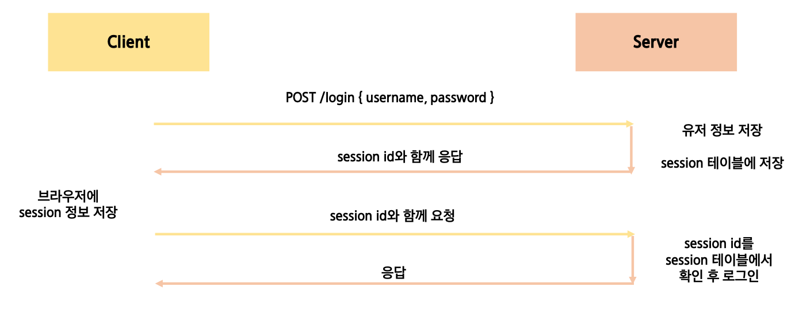
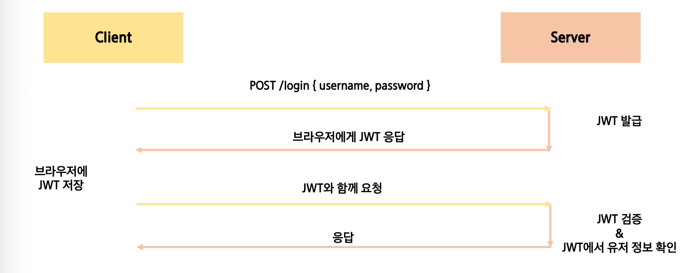
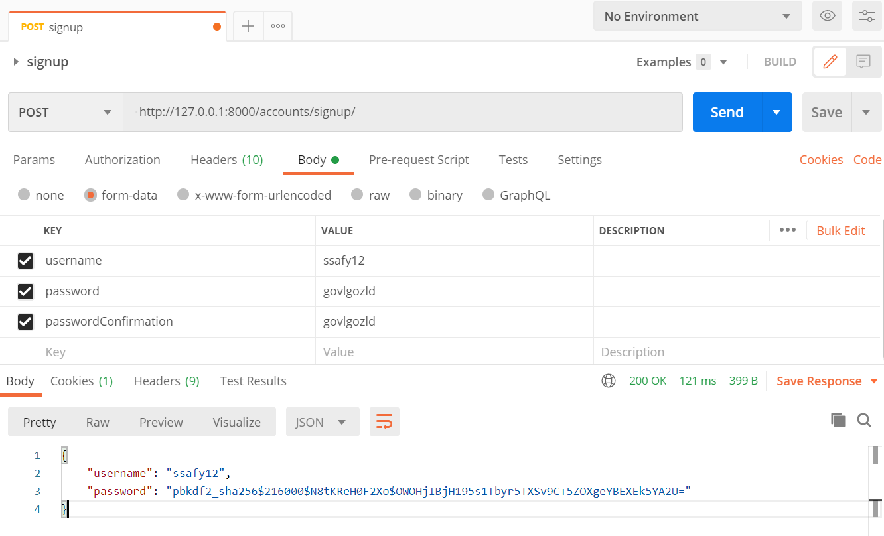
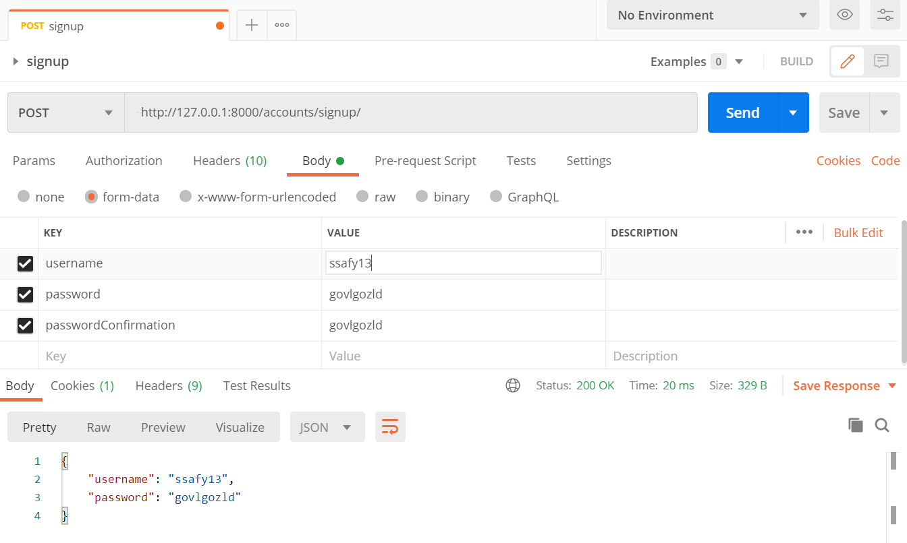

# 02_Authentication

> 2020.11.16 오후 라이브


## 1. Auth

### 1.1. Authentication & Authorization

| Authentication(인증)                                         | Authorization(권한/허가)                                     |
| ------------------------------------------------------------ | ------------------------------------------------------------ |
| Verifying **who a user is** <br />자신이라고 주장하는 유저 확인 | verifying what they have **access to**<br />유저가 자원에 접근할 수 있는지 여부 |
| Django -> 게시판 서비스 로그인                               | Django -> 일반 유저 vs 관리자 유저                           |
| 401 Unauthorized                                             | 403 Forbidden                                                |

- Django에서 로그인 이후에 글을 작성할 수 있는 것처럼 인증 이후에 획득할 수 있는 기본 권한 존재
- 권한 자체가 인증 여부를 반드시 포함하는 것은 아님


### 1.2. Session Based Authentication



- Server에서 session table의 정보 중 session id를 쿠키에 담아 Client에게 전달하면 Client는 이후의 요청에 session id 정보를 활용해 인증한다.


### 1.3. Token(JWT) Based Authentication



-  JWT 자체가 인증의 수단이 된다. 인증을 위한 도구(Session Table 등)가 필요없다.

- JWT가 탈취된 경우 심각한 보안적인 위협이 가해질 수 있다. JWT 유효 시간 설정, Refresh Token 등을 통해 이러한 문제를 최소화 시킬 수 있다.


### 1.4. Session ? Token ?

Session, Token(JWT) 기반의 인증 로직의 전체 흐름은 매우 유사하다.

- 두 방식의 핵심 차이점은 어떤 '도구'를 통해 '인증'을 하는지 여부다.
- 또한, Session은 인증의 수단이 Server에 존재하고 JWT는 그 자체가 인증의 도구(`self-contained`)이기 때문에 이를 저장하는 Client Storage에 인증 수단이 위치한다.

- JWT가 절대로 모든 상황에 최선인 만능 도구는 아니며 개발 환경 및 제공 서비스의 상황에 맞춰서 어떤 인증 도구를 사용할 지 결정해야 한다.


## 2. 코드의 흐름

본 마크다운에는 핵심 흐름만 포함되어 있습니다. 완성된 코드는 gitlab에서 확인 하시면 됩니다. 😁


1. Client - Signup

  - credential 정보 세팅
    - username, password, passwordConfirmation
    - `v-model`을 활용해 컴포넌트의 data와 양방향 바인딩

2. Server - Modeling

   기존 모델 변경

   ```python
   # accounts/models.py

   from django.db import models
   from django.contrib.auth.models import AbstractUser
   
   
   class User(AbstractUser):
       pass
   ```
   
   ```python
   # settings.py
   
   # Custom User Model
   AUTH_USER_MODEL = 'accounts.User'
   ```
   
   ```python
   # models.py
   
   class Todo(models.Model):
     # user.todo_set -> user.todos
     user = models.ForeignKey(settings.AUTH_USER_MODEL, on_delete=models.CASCADE, related_name='todos')
     title = models.CharField(max_length=50)
     completed = models.BooleanField(default=False)
   ```
   
   - User - Todo (1:N Relation)
   
   - User는 `AbstractUser`를 상속 받는 형태로 확장한다. 참고로 User를 확장하는 것은 (당장 사용하지 않더라도) 프로젝트의 방향성이 바뀔 수 있음을 고려하여 초반에 시작하고 진행한다.
   
   - 역참조 시에 `_set`의 형태가 아닌 `todos` 라는 이름으로 부르기 위해 `related_name` 설정
   
   - 이후 모델 초기화 작업 진행
   
3. Server - Signup

   ```python
   # accounts/serializers.py
   
   from rest_framework import serializers
   from django.contrib.auth import get_user_model
   
   User = get_user_model()
   
   class UserSerializer(serializers.ModelSerializer):
       password = serializers.CharField(write_only=True)
       
       class Meta:
           model = User
           fields = ('username', 'password',)
   ```

   ```python
   # accounts/views.py
   
   @api_view(['POST'])
   def signup(request):
     #1-1. Client에서 온 데이터를 받아서
     password = request.data.get('password')
     password_confirmation = request.data.get('passwordConfirmation')
   
     #1-2. 패스워드 일치 여부 체크
     if password != password_confirmation:
       return Response({'error': '비밀번호가 일치하지 않습니다.'}, status=status.HTTP_400_BAD_REQUEST)
   
     #2. UserSerializer를 통해 데이터 직렬화
     serializer = UserSerializer(data=request.data)
   
     #3. validation 작업 진행 -> password도 같이 직렬화 진행
     if serializer.is_valid(raise_exception=True):
       user = serializer.save()
       #4. 비밀번호 해싱 후
       user.set_password(request.data.get('password'))
       user.save()
       # print(user.password)
       # password는 직렬화 과정에는 포함 되지만 → 표현(response)할 때는 나타나지 않는다.
       return Response(serializer.data, status=status.HTTP_201_CREATED)
   ```

   - 비밀번호 해싱의 차이점 및 `write_only` 필드 설정 시 Response 데이터의 변화

   

   

4. Client - Singup

   ```javascript
   methods: {
       signup: function () {
         axios.post(`${SERVER_URL}/accounts/signup/`, this.credentials)
           .then((res) => {
             // console.log(res)
             this.$router.push({ name: 'Login' })
           })
           .catch((err) => {
             console.log(err)
           })
       }
     }
   ```

5. Server - JWT 발급

   - 기본 토큰 발급 설정을 override하여 새롭게 설정할 수 있다. 
   - 토큰의 유효 기간은 최대한 짧게 하는 것이 보안적인 측면에서 유리하지만 수업을 위해 1일로 설정한다.

   ```python
   # setting.py
   
   # JWT additional settings 
   import datetime 
   
   JWT_AUTH = {
       'JWT_EXPIRATION_DELTA': datetime.timedelta(days=1),
   }
   ```

   ```python
   # urls.py
   
   from rest_framework_jwt.views import obtain_jwt_token
   
   urlpatterns = [
       ...
       path('api-token-auth/', obtain_jwt_token),
   ]
   ```

6. Client - JWT 저장

   - Server로부터 발급 받은 JWT를 Browser localstorage API를 활용해 저장해보자
   - 토큰을 발급받고 이후의 요청에 포함시켜 보낼 것이다.

   ```javascript
   methods: {
     login: function () {
       axios.post(`${SERVER_URL}/accounts/api-token-auth/`, this.credentials)
         .then((res) => {
   				// console.log(res.data.token)
           // console.log(localStorage)
           localStorage.setItem('jwt', res.data.token)
           // console.log(localStorage.getItem('jwt')) // token
           this.$router.push({ name: 'TodoList' })
         })
         ...
     }
   ```

7. Client - Logout

   - 발급 받은 토큰을 Browser에서 삭제하는 행위가 로그인이다.
   - 단, 브라우저에서 토큰을 삭제한다고 해도 토큰의 유효 기간 내에서는 탈취 당할 경우 보안 인증에 문제가 생길 수 있으니 유의해야 한다.

   

   여기서 logout 링크에 `.native`는 무엇일까?

   - `router-link`는 a 태그로 렌더링 되지만 본연의 링크 이벤트를 없애고 Vue에서 사용되는 특수한 형태로 만들어 진 태그이다.
   - 링크 태그의 고유 이벤트가 발생하지 않아 Click이라는 이벤트가 발생하지 않고 실제 Click 행위가 발생 했을 때 로그아웃 함수를 실행할 수 없게 된다.

   - 따라서 본연의 네이티브한 이벤트를 실행 시키기 위해 속성을 달아준다. (`to` 프로퍼티는 값을 비워두고 없으면 렌더링이 안되기 때문에 `#`을 넣어서 자리만 만들어놓자)

   ```javascript
   // App.vue
   
   methods: {
     logout: function () {
       localStorage.removeItem('jwt') // localStorage에서도 jwt를 삭제
       this.$router.push({ name: 'Login' })
     },
   },
   ```

   ```html
   <!-- App.vue -->
   
   ...
   <div id="nav">
     <span v-if="login">
       <router-link :to="{ name: 'TodoList' }">Todo List</router-link> |
       <router-link :to="{ name: 'CreateTodo' }">Create Todo</router-link> |
   		<router-link @click.native="logout" to="#">Logout</router-link>
     </span>
   ```

   

   - 로그아웃 여부에 따라서 `router-link`를 다르게 보여주자.
   - Django의 `base.html`에서 했던 것과 동일한 형태로 구성할 수 있다.

   ```javascript
   // App.vue
   
   export default {
     name: 'App',
     data: function () {
       return {
         login: false,
       }
     },
     created: function () {
   		//1. Vue Instance가 생성된 직후에 호출되어 jwt를 가져온다.
       const token = localStorage.getItem('jwt')
   		//2. 토큰이 있으면
       if (token) {
   			//3. true로 변경하고 없으면 그대로 두자
         this.login = true
   		}
     },
   }
   ```

   ```html
   <!-- App.vue -->
   
   <template>
     <div id="app">
       <div id="nav">
         <span v-if="login">
           <router-link :to="{ name: 'TodoList' }">Todo List</router-link> |
           <router-link :to="{ name: 'CreateTodo' }">Create Todo</router-link>
         </span>
         <span v-else>
           <router-link :to="{ name: 'Signup' }">Signup</router-link> |
           <router-link :to="{ name: 'Login' }">Login</router-link> 
         </span>
       </div>
       <router-view/>
     </div>
   </template>
   ```

   

   - 추가적으로 로그아웃 이후에 `Login` 컴포넌트에서 `App` 컴포넌트로 이벤트를 활용해 알려 `login` 데이터의 상태를 변경 시키자

   - 부모 컴포넌트는 자식에서 올라온 이벤트를 감지하고 `login` 데이터의 값을 변경한다.

    ```javascript
   // Login.vue
   
   login: function () {
     axios.post(`${SERVER_URL}/accounts/api-token-auth/`, this.credentials)
     .then((res) => {
       
       localStorage.setItem('jwt', res.data.token)
   		// 이 시점 어딘가에서 값을 바꿔줘야 한다. 그럼 끝? 아니 App 컴포넌트는 이 데이터가 바뀐 사실을 모른다.
       // 어떻게 해야 한다? 알려줘야 한다. 부모로 이 사실을 알리자./
       // 그럼 부모에서 state를 알아서 바꿀 것이다. (emit event 상황에서 payload를 반드시 넘길 필요는 없다.)
       this.$emit('login')
       this.$router.push({ name: 'TodoList' })
     })
    ```

   ```html
   // App.vue
   
   <template>
     <div id="app">
       <div id="nav">
         <span v-if="login">
           ...
         </span>
         <span v-else>
           <router-link :to="{ name: 'Signup' }">Signup</router-link> |
           <router-link :to="{ name: 'Login' }">Login</router-link> 
         </span>
       </div>
       <router-view @login="login = true"/>
     </div>
   </template>
   
   <script>
   export default {
     name: 'App',
     data: function () {
       return {
         login: false,
       }
     },
   	...
   ```

8. Server - Authentication & Authoirzation

   - 데코레이터의 순서가 중요하다. `api_view`보다 토큰 유효성 검사 및 인증 여부 검사 데코레이터가 밑에 위치해야 한다.

   ```python
   # todos/views.py
   
   from rest_framework.decorators import authentication_classes, permission_classes
   from rest_framework.permissions import IsAuthenticated
   from rest_framework_jwt.authentication import JSONWebTokenAuthentication
   ```

   ```python
   @api_view(['GET', 'POST'])
   
   # JWT가 유효한지 여부를 판단하는 데코레이터
   @authentication_classes([JSONWebTokenAuthentication])
   # 해당 함수를 호출 할 권한이 있는지 여부를 '인증' 여부로 판단하는 데코레이터
   @permission_classes([IsAuthenticated])
   def todo_list_create(request):
       if request.method == 'GET':
           todos = Todo.objects.all()
           # 해당 요청을 보낸 user(==로그인이 된 user)의 todo만 볼 수 있도록 Serializing 작업
           # serializer = TodoSerializer(todos, many=True)
           serializer = TodoSerializer(request.user.todos, many=True)
           return Response(serializer.data)
       else:
           serializer = TodoSerializer(data=request.data)
           if serializer.is_valid(raise_exception=True):
             	# N(todo)의 입장에서 참조하는 1(user)의 정보를 DB에 저장하는 시점에 추가
               serializer.save(user=request.user)
               return Response(serializer.data, status=status.HTTP_201_CREATED)
             
             
   @api_view(['PUT', 'DELETE'])
   @authentication_classes([JSONWebTokenAuthentication])
   @permission_classes([IsAuthenticated])
   def todo_update_delete(request, todo_pk):
       todo = get_object_or_404(Todo, pk=todo_pk)
   	
     	# 본인이 작성한 todo가 아니면 수정 & 삭제를 할 수 없게 만드는 validation 작업
       if not request.user.todos.filter(pk=todo_pk).exists():
           return Response({'detail': '권한이 없습니다.'})
           
       if request.method == 'PUT':
           serializer = TodoSerializer(todo, data=request.data)
           if serializer.is_valid(raise_exception=True):
               serializer.save()
               return Response(serializer.data)
       else:
           todo.delete()
           return Response({ 'id': todo_pk })       
   ```

9. Client - Request with authentication things

   - JWT를 localstorage에서 가져오는 함수를 따로 구성
   - CRUD Operation을 담당하는 각 로직에 JWT를 포함시켜 요청 
   - 이때 반드시 Axios에서 각 Method별 configuration 위치 확인
     - GET & DELETE
     - POST & PUT

   ```javascript
   // CreateTodo.vue
   
   setToken: function () {
     const token = localStorage.getItem('jwt')
   
     const config = {
       headers: {
         Authorization: `JWT ${token}`
       }
     }
     return config
   },
     createTodo: function () {
       const config = this.setToken()
   
       const todoItem = {
         title: this.title,
       }
   
       if (todoItem.title) {
         axios.post(`${SERVER_URL}/todos/`, todoItem, config)
   ```

   ```javascript
   // TodoList.vue
   
   setToken: function () {
     const token = localStorage.getItem('jwt')
   
     const config = {
       headers: {
         Authorization: `JWT ${token}`
       }
     }
     return config
   },
    getTodos: function () {
      const config = this.setToken()
   
      axios.get(`${SERVER_URL}/todos/`, config)
        .then((res) => {
      ...
      },
    deleteTodo: function (todo) {
      const config = this.setToken()
   
      axios.delete(`${SERVER_URL}/todos/${todo.id}/`, config)
     ...
    },
    updateTodoStatus: function (todo) {
      const config = this.setToken()
      ...
      axios.put(`${SERVER_URL}/todos/${todo.id}/`, todoItem, config)
    },
    ...
   ```

   


## 참고 자료

| 문서 제목                                                    | 비고                    |
| ------------------------------------------------------------ | ----------------------- |
| [Window.localStorage](https://developer.mozilla.org/ko/docs/Web/API/Window/localStorage) | MDN                     |
| [djangorestframework-jwt](https://jpadilla.github.io/django-rest-framework-jwt/) | REST framework JWT Auth |
| [Permissions](https://www.django-rest-framework.org/api-guide/permissions/#setting-the-permission-policy) | Django REST framework   |
| [write_only](https://www.django-rest-framework.org/api-guide/fields/#write_only) | Django REST framework   |
| [Specifying fields explicitly](https://www.django-rest-framework.org/api-guide/serializers/#specifying-fields-explicitly) | Django REST framework   |
| [Substituting a custom User model](https://docs.djangoproject.com/en/3.1/topics/auth/customizing/#substituting-a-custom-user-model) | Django                  |
| [set_password()](https://docs.djangoproject.com/en/3.1/ref/contrib/auth/#django.contrib.auth.models.User.set_password) | Django                  |
| [jwt.io](https://jwt.io/)                                    | jwt Encoding & Decoding |

​	