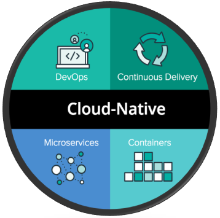
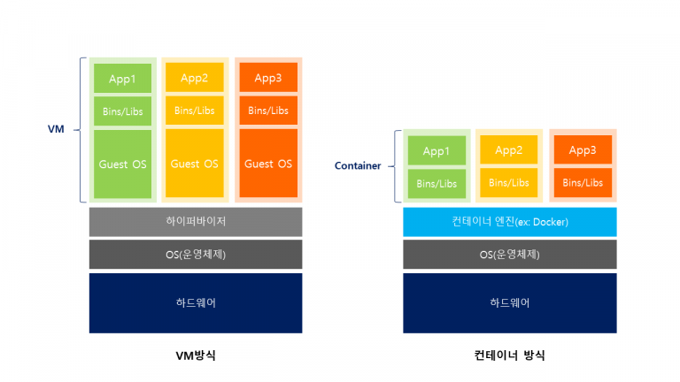
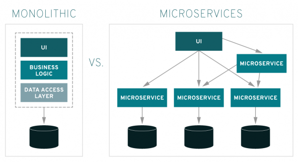

### **클라우드 네이티브 정의**

**넓은 의미의 정의**

넓은 의미로 정의해 본다면 클라우드의 이점을 최대로 활용할 수 있도록 애플리케이션을 구축하고 실행하는 방식을 말합니다.
기존 시스템에서의 애플리케이션은 클라우드의 이점을 100% 활용하지 못했다면, 마이크로서비스 아키텍처를 채택하고 컨테이너, 쿠버네티스와 같은 기술과 도구, DevOps, 애자일 방법론 등을 도입하여 개발자 생산성, 비즈니스 민첩성, 확장성, 가용성 및 비용 절감 효과를 크게 높일 수 있습니다.

그러기 위해서는 애플리케이션, 아키텍처, 인프라 및 개발 프로세스 등 전방위적 측면에서 변화가 필요한데요,
변화의 방향은 무엇이며 클라우드를 네이티브하게 사용한다는 뜻은 무엇인지 알아보겠습니다.

바로, 아래 리눅스 재단의 정의를 통해 참고해 볼 수 있습니다.

**CNCF 정의**

2015년 처음 Cloud Native라는 용어를 사용한 리눅스는 CNCF(Cloud Native Computing Foundation)재단을 만들어 클라우드 네이티브로 전환할 수 있는 오픈소스 기술들을 추진하고 관리합니다. 이 재단에는 550개가 넘는 여러 클라우드 공급자와 기술 기업들이 참여하여 운영되고 있는데 클라우드 네이티브에 대한 정의를 아래와 같이 하고 있습니다.

   • 퍼블릭, 프라이빗, 하이브리드 클라우드 환경에서 확장성 있는 애플리케이션을 만들고 운영할 수 있다.

   • 컨테이너, 서비스 메시, 마이크로서비스, 불변의 인프라스트럭처, 그리고 선언적 API가 전형적인 접근 방식에 해당한다.

   • 회복성이 있고, 관리 편의성을 제공하며, 가시성을 갖는 느슨하게 결합된 시스템을 사용할 수 있다.

   • 견고한 자동화와 함께 사용하면, 엔지니어는 최소한의 수고로 영향력이 크고 예측 가능한 변경을 할 수 있다.

CNCF 클라우드 네이티브 정의 참고 : https://github.com/cncf/toc/blob/master/DEFINITION.md

### 클라우드 네이티브를 위한 주요 4가지 요소

위의 정의를 정리해 보면, 클라우드 네이티브로 가기 위한 주요 요소는 아래 4가지로 요약할 수 있습니다.

<그림 참고 : [Chirag Jog’s Blog](https://medium.com/velotio-perspectives/cloud-native-applications-the-why-the-what-the-how-9b2d31897496)>

**1. DevOps**
애플리케이션 개발-운영 간의 협업 프로세스를 자동화하는 것을 말하며 결과적으로 애플리케이션의 개발과 개선 속도를 빠르게 합니다.

**2. CI/CD**
지속적인 통합(Continous Intergration)은 개발자가 작업한 코드를 자동으로 테스트하고 테스트에 통과하면 코드를 통합하여 저장합니다.
지속적인 배포(Continuos Deployment)는 작업한 코드 및 변경사항들은 테스트를 거쳐 리포지토리에 업로드되고 실 서비스 배포로 릴리즈까지 자동화하는 것을 말합니다.

**3. 컨테이너 기반 인프라
**가상화 기술 중 하나로, 시스템을 가상화하는 것이 아니라 애플리케이션을 구동할 수 있는 컴퓨팅 작업을 패키징하여 가상화한 것입니다.

**4. Microservice**
애플리케이션을 구성하는 서비스들을 독립적인 작은 단위로 분해하여 구축하고 각 구성 요소들을 네트워크로 통신하는 아키텍처로 서비스 안정성과 확장성(scaling)을 지원합니다.

위 4가지 요소들의 개념을 간단하게 적어보았는데요, 짧은 한 두 줄의 설명으로는 아직 와닿지 않습니다… 

### 클라우드 네이티브를 이해하기 위해서…

위의 4가지 요소 중 클라우드 네이티브 애플리케이션 개발의 구조적인 측면에서 주축이 되는 컨테이너와 마이크로서비스에 대해 알아보도록 하겠습니다.

#### **컨테이너**

IT 기술의 컨테이너도 물류 분야의 컨테이너처럼 이동성을 실현하기 위한 기술입니다.
즉, 어느 환경이나 어느 인프라로든 쉽게 이동할 수 있다는 말인데요, 컨테이너는 애플리케이션을 실행하기 위한 컴퓨팅 작업을 패키징하여 이미지로 만들기 때문에 경량화되어있고, 서버나 OS 환경에 종속적이지 않아 진정한 애플리케이션 이식성이 실현됩니다.

이해를 돕기 위해 컨테이너와 대조되는 하이퍼바이저 기반의 가상화와 비교해보겠습니다.

하이퍼바이저 기반의 가상화(VM 방식)는 애플리케이션이 돌아갈 수 있는 OS 환경이 포함됩니다. 그렇기 때문에 애플리케이션을 실행하기 위해서는 VM을 띄워 자원을 할당한 다음, OS를 부팅한 후 애플리케이션을 구동할 수 있기 때문에 시간이 오래 걸립니다.

반면, 컨테이너 기반의 가상화 방식은 프로세스 간 벽을 만들어 애플리케이션이 구동되는 환경이 격리(컨테이너화)되어 있기 때문에 각 각의 APP에 OS를 개별로 구성해줄 필요 없이 하나의 OS 커널*을 공유하여 사용합니다. OS가 필요하지 않음으로 더 가볍고 크기도 작아 복제와 배포에도 간편합니다.

따라서, 애플리케이션을 구동하기 위해서 OS가 필요하지 않아 가볍고, 애플리케이션 실행에 필요한 모든 것(라이브러리, 바이너리, 기타 구성 파일 등)을 패키지로 묶어 컨테이너 이미지를 만들어 사용하기 때문에 컨테이너가 작동하는 환경이라면 어디서든지 실행시킬 수 있다는 장점이 있습니다.

> *커널이란?
>
> : 운영 체제의 핵심으로 하드웨어의 자원(CPU, Memory, Devices)을 각 프로세스에 사용할 수 있도록 나눠주고, 프로세스 및 메모리 제어 등 시스템의 모든 것을 통제합니다.

특징을 정리해 보면,

   \1. **경량화** – 앱 구동을 위해 게스트 OS가 포함되지 않습니다.

   \2. **효율성** – 호스트 OS 커널을 공유하므로, 자원을 미리 할당하지 않고 애플리케이션 동작에 필요한 컴퓨팅 자원만 필요로 합니다.

   \3. **이식성** – 컨테이너가 작동하는 환경이라면 어디든지 작동시킬 수 있습니다.

   \4. **안정성** – 호스트 OS 커널을 공유하는 구조로 장애 발생 시, 다른 컨테이너들이 영향을 받을 수 있습니다.

#### **마이크로서비스**

마이크로서비스 아키텍처는 애플리케이션을 이루는 서비스들을 기능 단위로 쪼개서 구축하는 것을 말합니다. 서비스끼리는 프로그래밍 언어에 구속받지 않는 API(Application Programming Interface)를 통해서 통신하며 각 서비스는 각각 자체 DB를 가지게 됩니다.

모놀리식 아키텍처와 비교해 본다면,

<그림 참고 : [Red Hat Site](https://www.redhat.com/ko/topics/microservices/what-are-microservices)> 

모놀리식은 전체 애플리케이션이 하나의 통합된 패키지 형태로 구성되어 있고 구성 모듈들이 의존적으로 연결되어 있기 때문에 기능 하나를 변경하려면 전체 애플리케이션을 재배포해야 하는 번거로움이 있습니다. 같은 이유로 특정 모듈만 확장하기가 어렵고 애플리케이션을 담고 있는 서버 자체를 늘려야 하는 비효율적 구조입니다. 또한, 개발 초기에 사용한 기술 스택에 고정되어 사용 해야 한다는 제약이 있습니다.

반면, 마이크로서비스 아키텍처는 애플리케이션을 작은 기능으로 나누어 구축하기 때문에 개별 서비스들을 더 쉽게 변경하거나 확장할 수 있으며, 서비스마다 다른 언어, 프레임워크, 라이브러리를 사용할 수 있다는 장점이 있습니다. 하지만, 모놀리식 보다는 구조가 복잡하고 여러 서비스에 데이터가 분산되어 있어 데이터 관리가 어렵다는 단점이 있습니다.

특징을 정리해 보면,

   \1. **확장성** – 전체 애플리케이션을 담고 있는 서버를 추가하거나 사양을 늘리는 것이 아니라, 리소스를 더 필요로 하는 모듈만 수평, 수직적으로 쉽게 확장할 수 있습니다.

   \2. **생산성** – 개발자는 해당 기능(서비스)에만 집중하여 개발할 수 있으며 테스트/배포에 걸리는 시간도 줄일 수 있어 생산성을 높일 수 있습니다.

   \3. **안정성** – 모놀리식 구조에서는 하나의 장애가 전체 애플리케이션에 영향을 줄 수 있으며 찾아내기도 어렵습니다. 반면 서비스들이 분리된 독립적인 구조에서는 장애를 그 서비스에 한정적으로 격리할 수 있습니다.

   \4. **복잡성** – 여러 서비스가 분산되어 얽혀 있기 때문에 복잡성이 높으며, 분산시스템을 어떻게 구성할 것인지에 대한 어려움이 있습니다.

> *수평 확장(Scale Out) : 서버 대수를 늘림
>
> *수직 확장(Scale Up) : 서버 사양을 늘림

#### **DevOps와 CI/CD**

DevOps는 ‘개발과 IT 운영 간의 프로세스를 통합하여 궁극적으로는 고객에게 뛰어난 품질의 서비스를 빠르게 제공한다’는 개발 방법론입니다.
그렇다면 개발(Dev)과 운영(Ops)의 업무는 다른데 왜 통합하려고 하는가? 인데요,

과거 새로운 서비스를 출시하기 위해서 오랜 기간 작업 후 배포했던 것과 달리, 현재는 서비스 출시 속도가 빠르고 업데이트 주기 또한 빈번해졌습니다. 그렇기 때문에 개발된 소프트웨어가 시스템의 안정성을 유지하면서 사용자에게 빠르게 제공될 수 있도록 [개발-테스트-배포-운영]의 업무 사이클을 자동화된 단일 워크플로우로 통합할 필요성이 생긴 것입니다.

DevOps를 하려면,

   **• 소스 코드 제어(SCM, Source Code Management)  
**   서비스는 보통 팀 단위로 개발되는데, 서로 다른 팀에서 개발한 코드에 대한 버전과 이력을 관리해야 합니다.

   **• CI/CD  
**    CI/CD는 위에서 설명한 것 같이 지속적인 통합과 배포를 통해 애플리케이션 개발 단계를 자동화하여 고객에게 보다 짧은 주기로 서비스를
    제공하고 개선하는 방법입니다.

   **• 모니터링**
    업데이트 빈도가 늘어남에 따라 일반적으로 요구되는 엄격한 테스트를 매번 수행할 수가 없습니다. 따라서, 데브옵스 환경에서는 실시간으로
    앱 및 성능 모니터링을 통하여 오류, 개선사항을 찾아 해결하는 것이 중요합니다.

   **• 문화  
**    지난 [컬럼](https://cloudmt.co.kr/?p=3436)에서도 이야기한 바와 같이 DevOps는 개발과 운영 방식을 너머 사일로(silo, 부서 이기주의)를 없앤 ‘협업 문화’라고 볼 수 있습니다.
    <참고 : [DevOps를 하려면 무엇부터 해야 할까?](https://cloudmt.co.kr/?p=3436)>

### 넷플릭스 사례로 보는 클라우드 네이티브의 이점

2016년 ‘클라우드 네이티브 기업이 됐다’고 선언한 넷플릭스는 무려 7년 동안 IT인프라를 데이터센터에서 클라우드(AWS)로 이관하면서 있는 그대로 옮기는 것이 아닌 전체 시스템을 클라우드 네이티브 방식으로 재설계했습니다.

***당면한 문제는 무엇이었을까?***

**• 모놀리식 구조로 인한 개발/개선 속도가 느림**
변경이 발생할 때마다 모든 사람들이 한꺼번에 붙어서 작업을 해야 하고, 변경 시 문제가 발생되면 문제를 찾는 것 자체가 일이 되어버려 앱을 개발하고 개선하는 것이 비효율적이었습니다.

**• 데이터베이스 의존적
**거대한 하나의 오라클 데이터베이스를 사용했는데, 데이터베이스가 다운되면 모든 시스템이 다운되었으며, 매 2주마다 새 스키마를 적용하기 위해 적어도 10분의 가동 중지 시간이 생겼습니다.

**• 데이터센터 비대화
**트래픽이 몰리면 하드웨어를 추가해야 하며, 영상 스트리밍이라는 본질보다 데이터 센터가 더 커질 수 있는 상황이 되었습니다.

***클라우드 네이티브 도입***

**• 마이크로서비스 아키텍처 도입**
기능 하나를 고치거나 새 기능을 추가할 때 서비스를 통째 뜯어고칠 필요 없이 그 기능에 해당하는 애플리케이션만 손보면 되기 때문에 서비스를 빠르게 수정, 보안했습니다.

**• DevOps 환경 구축
**넷플릭스의 경우 풀 사이클 개발자라는 개념으로 자사만의 데브옵스를 실천했습니다. 즉, 만든 사람이 운영하고 문제가 발생하면 직접 고치는 구조인데요, 개발자들이 들으면 눈이 커질 이야기지만 어찌 됐든 애플리케이션을 개발하고 테스트, 배포, 운영, 지원의 사이클을 신속하게 처리할 수 있는 DevOps 환경을 구축했습니다.

**• NoSQL 데이터 구조
**무거운 관계형 데이터베이스에서 NoSQL 데이터베이스 구조로 변경하여 DB도 기능별로 나누어 사용하여 확장성, 고가용성을 확보했습니다.

**• 회복성 있는 아키텍처
**데이터센터든 클라우드든 인스턴스 장애는 일어나기 마련입니다. 따라서, 하드웨어 가용성에 의존하는 대신 자체 회복력을 가지는 아키텍처를 설계했습니다. 

넷플릭스는 하루아침에 클라우드 네이티브를 도입한 것이 아닙니다. 사실상 모든 기술을 재구축하고 조직과 운영 방식을 근본적으로 바꿨기 때문에 많은 시간과 노력이 필요했습니다. 새로운 기술과 도구를 테스트하는 과정에서 숱한 실패도 맛보았으나 문제점을 계속 발견하고 수정함으로써 결과적으로는 경쟁 업체보다 훨씬 뛰어난 시스템을 개발할 수 있었습니다.

### 정리하며…

이제 클라우드의 사용은 보편화 되었습니다.
그러나 아직 많은 사용자들이 클라우드를 인프라 중심으로 사용하고, 애플리케이션은 여전히 클라우드 이전 시대에 머물러 있다고 합니다.
넷플릭스가 클라우드로 이전하면서 애플리케이션 중심의 클라우드 네이티브로 전면 재설계한 이유는 인프라만 클라우드로 옮기게 된다면 기존에 지닌 모든 문제와 한계점을 그대로 옮기는 것밖에 되지 않는다는 것을 알았기 때문입니다.

클라우드 네이티브로 가기 위해서는 애플리케이션 중심의 설계가 필요하며 그것을 자동화하여 운영하는 것이 필요합니다.
그 방법으로는 다양한 기술과 도구, 방법론이 있으며 무엇보다 조직의 변화도 중요합니다. 조직의 현재 구조를 고려한 비즈니스 설계가 아닌, 기술에 맞춰 조직이 변화해야 하는 것입니다. 즉, 클라우드 네이티브로 간다는 것은 IT 인프라에서부터 조직이 일하는 구조와 방식까지 모두 재설계하는 과정이 될 것입니다.