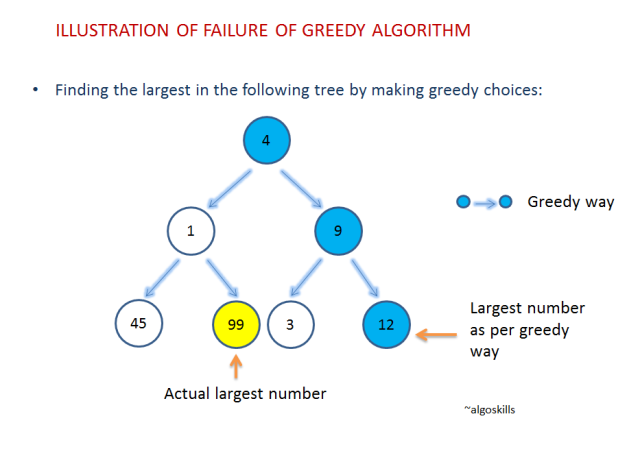
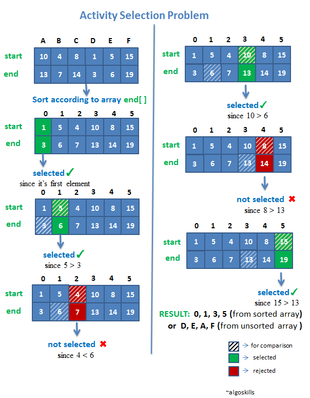

# 동적 계획법(Dynamic Programming)과 탐욕법(Greedy Algorithm)


## Dynamic Programming (동적 계획법)

**Dynamic Programming은 전체 문제를 여러 개의 하위 문제로 나누어 풀고, 하위 문제들의 해결 방법들을 결합하여 최종 문제를 해결하는 문제 해결 방식이다.**

길이 막힐 때 돌아가는 길로 가는 것이 더 빠르게 도착한다는 사실을 알고 있다면 같은 상황에서 돌아가는 길을 계속 선택한다. 그럼 결국 최적의 경로를 찾게 된다.

다시 말하면 최종 문제를 해결하는 많은 방법들을 모두 탐색하게 된다. 하위 문제들 각각의 해결 방법들을 모두 탐색하기 때문이다. 하지만, 반복되는 하위 문제를 찾아 간단히 해결하도록 만드는 것으로 계산 횟수를 줄일 수 있다.

뭔소린지 모르겠으니 예시를 살펴보자
wikipedia에 소개된 Dynamic programming의 대표적인 예시는 피보나치 수열이다.

### 이에 관한 알고리즘 문제를 풀어보자

```null
피보나치 수열 : 수열의 n번째 위치에서 앞의 두 수를 더한 값이 위치하는 수열
(첫번째와 두번째는 0과 1이다.)
[1, 1, 2, 3, 5, 8 .....]
```

여기서 n번째 있는 수를 찾는 함수는

```javascript
function fn (n) {
  if (n === 0) {
    return 1;
} else if (n === 1) { 
    return 1;
} else { 
    return fn(n-1) + fn(n-2);
}
```

위와 같이 표현할 수 있다. 그런데, 이렇게 모든 값을 계산을 하게 되면 아래와 같은 문제가 생긴다.

```javascript
fn(5);
fn(4) + fn(3);
fn(3) + fn(2) + fn(2) + fn(1)
fn(2) + fn(1) + fn(1) + fn(0) + fn(1) + fn(0) + fn(1)
```

.......
`fn(2)`는 이미 계산이 되어 알고 있는데 계속 결과를 구하는 과정이 반복이 된다. 숫자가 커질 수록 이런 중복 계산은 기하급수적으로 많아질 것이다.
또한 `fn(3)`와 같은 경우도 미리 결과 값을 알고 있다면 반복해서 계산할 필요가 없을 것이다. `fn(4)`도 마찬가지이다.

그럼 방법이 생겼다. 함수가 돌아가면서 새로운 인자를 가진 함수가 실행되면 그 값을 객체에 저장하고, 이미 저장된 함수를 실행하면 그 값을 그냥 가져오자

```javascript
var obj = { 
  0: 1, 
  1: 1
} 
// 부분 함수의 결과 값을 저장하는 obj
// key는 부분 함수의 인자이다.
// value는 fn(key)의 결과이다.
```

위의 객체를 이용한 피보나치 수를 구하는 알고리즘은 다음과 같다.

```null
function fn(n) {
  if (!obj[n]) {
    obj[n] = fn(n - 1) + fn(n - 2);
  }
  return obj[n];
}
```

함수의 결과 값을 저장하면서 최종 결과물을 찾는 함수이다. 이러한 방식으로 계산 횟수를 줄이면서 전체 값을 모두 탐색할 수 있다.

서두에서 말한 약속장소를 빠르게 찾아가는 법을 미리 모두 비교해보는 방법이 바로 Dynamic Programming이다. 계산 횟수를 줄이면서 모든 방법들을 검토하여 최적의 해결 방법을 나름 효율적으로 찾을 수 있다.

이러한 Dynamic Programming을 이용한 다양한 알고리즘 문제들이 있는데,

- 최장 공통 부분 수열
- 부분집합의 합
- 배낭 문제

등이 있다.
출처 : https://www.algoskills.com/greedy.php

## Greedy Algorithms(탐욕법, 탐욕 알고리즘)

**Greedy Algorithm은 문제를 해결하는 과정에서 그 순간순간마다 최적이라고 생각되는 결정을 하는 방식으로 진행하여 최종 해답에 도달하는 문제 해결 방식이다.**



위의 그림에서는 가장 숫자가 큰 요소를 찾는데 있어서 해당 분기점마다 보다 큰 수를 찾는 방식으로 최종 해답을 찾아가고 있다. 순간마다 큰 수를 찾아가면 최종 결과는 12이다. 하지만 실제 전체 숫자 중에서 가장 큰 수는 99이다. 이처럼 전체 문제해결에서의 최적 해답을 찾지는 못한다.

순간 순간마다의 최선의 결정이 전체 문제에서 최선의 해결책이 되지 않는다.
우리는 인생의 순간에서 매번 최선의 결정을 하게 되지만 그것이 언제나 ‘최적’이 아니듯이…

**하지만 이러한 단점들을 극복하는 Greedy의 가장 큰 장점은 계산 속도에 있다. 그래서 Greedy 방법이 통하는 몇몇의 문제에서는 최적해를 빠르게 산출해낼 수 있다.**

빠른 계산 속도의 장점으로 앞서 말한 Dynamic Programming과 서로 보완하는 개념으로 알려져 있다.

*출처 : https://www.algoskills.com/activityselection.php*

### Greedy Algorithm — 활동 선택 문제

대표적인 예제로 더 자세히 알아보자. 활동 선택 문제(Activity Selection Problem)으로 Greedy를 사용할 수 있다.

문제의 이해
각각의 활동들은 시작시간과 종료시간이 있다. 한 사람이 최대한 많이 할 수 있는 액티비티의 수와 액티비티의 종류를 구해보자.

```null
1. 각각의 활동들은 시작시간과 종료시간이 주어져 있다.
2. 한 사람이 하는 것이므로 한 가지 액티비티를 종료하여야 다른 액티비티를 할 수 있다.
```

### 해결 방법 찾기

1) 첫 번째 활동은 가장 먼저 끝나는 것으로 선택하는 것이 현재 상황에서 가장 최선의 선택이다. (주어진 시간 내에 많이 액티비티를 해야 하므로)
// -> 가장 먼저 시작하는 'D'활동을 실시한다.

2) D활동이 끝난 후 또 다시 가장 빠르게 끝낼 수 있는 활동을 찾는다.
// -> E활동이 그 다음 할 수 있는 활동 중에 가장 먼저 끝난다.

3) E활동이 끝난 후 똥 다시 가장 빠르게 끝낼 수 있는 활동을 찾는다.
... 이러한 방식으로 답을 찾아간다.

위의 그림으로 쉽게 이해할 수 있다.

Greedy는
**탐욕스러운 선택 조건(Greedy choice property)**
**최적 부분 구조 조건(Optimal Substructure)**
위의 조건이 성립되어야 잘 작동한다.

**<탐욕스러운 선택 조건 (Greedy choice property)>**
앞의 선택이 이후의 선택에 영향을 주지 않는 조건.

**<최적 부분 구조 조건(Optimal Substructure)>**
문제에 대한 최종 해결 방법이 부분 문제에 대해서도 또한 최적 문제 해결 방법이다는 조건.

지금까지 Dynamic Programming과 Greedy Algorithm 에 대해 알아 보았는다. 무엇이 더 효과적인 문제 해결 방법인지는 상황마다 매우 다를 것이다. 서로 보완하고 있는 점이 많으므로 상황마다 최적의 해결 방식을 선택하면 된다. `Greedy처럼.`