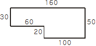

# BAEKJOON

# 2477: 참외밭

### 문제

시골에 있는 태양이의 삼촌 댁에는 커다란 참외밭이 있다. 문득 태양이는 이 밭에서 자라는 참외가 도대체 몇 개나 되는지 궁금해졌다. 어떻게 알아낼 수 있는지 골똘히 생각하다가 드디어 좋은 아이디어가 떠올랐다. 유레카! 1m^2의 넓이에 자라는 참외 개수를 헤아린 다음, 참외밭의 넓이를 구하면 비례식을 이용하여 참외의 총개수를 구할 수 있다.

1m^2의 넓이에 자라는 참외의 개수는 헤아렸고, 이제 참외밭의 넓이만 구하면 된다. 참외밭은 ㄱ-자 모양이거나 ㄱ-자를 90도, 180도, 270도 회전한 모양(┏, ┗, ┛ 모양)의 육각형이다. 다행히도 밭의 경계(육각형의 변)는 모두 동서 방향이거나 남북 방향이었다. 밭의 한 모퉁이에서 출발하여 밭의 둘레를 돌면서 밭경계 길이를 모두 측정하였다.



예를 들어 참외밭이 위 그림과 같은 모양이라고 하자. 그림에서 오른쪽은 동쪽, 왼쪽은 서쪽, 아래쪽은 남쪽, 위쪽은 북쪽이다. 이 그림의 왼쪽위 꼭짓점에서 출발하여, 반시계방향으로 남쪽으로 30m, 동쪽으로 60m, 남쪽으로 20m, 동쪽으로 100m, 북쪽으로 50m, 서쪽으로 160m 이동하면 다시 출발점으로 되돌아가게 된다.

위 그림의 참외밭  면적은 6800m^2이다. 만약 1m^2의 넓이에 자라는 참외의 개수가 7이라면, 이 밭에서 자라는 참외의 개수는 47600으로 계산된다.

1m^2의 넓이에 자라는 참외의 개수와, 참외밭을 이루는 육각형의 임의의 한 꼭짓점에서 출발하여 반시계방향으로 둘레를 돌면서 지나는 변의 방향과 길이가 순서대로 주어진다. 이 참외밭에서 자라는 참외의 수를 구하는 프로그램을 작성하시오.

### 입력

첫 번째 줄에 1m^2의 넓이에 자라는 참외의 개수를 나타내는 양의 정수 K (1≤K≤20)가 주어진다. 참외밭을 나타내는 육각형의 임의의 한 꼭짓점에서 출발하여 반시계방향으로 둘레를 돌면서 지나는 변의 방향과 길이 (1 이상 500 이하의 정수) 가 둘째 줄부터 일곱 번째 줄까지 한 줄에 하나씩 순서대로 주어진다. 변의 방향에서 동쪽은 1, 서쪽은 2, 남쪽은 3, 북쪽은 4로 나타낸다.

### 출력

첫째 줄에 입력으로 주어진 밭에서 자라는 참외의 수를 출력한다.


#### 풀이

```python
K = int(input())
len_stack = []
dir_stack = []
for _ in range(6):
    dir, length = map(int,input().split())
    len_stack.append(length)
    dir_stack.append(dir)

max_min_len = set()

for i in range(0,6):
    for j in range(i+2,6):
        if len_stack[i]+len_stack[j] in len_stack:
            max_min_len.add(len_stack[i]+len_stack[j])

Garo = max(max_min_len)
Sero = min(max_min_len)
# print(Garo, Sero)
Garo_idx = len_stack.index(Garo)
len_stack[Garo_idx] = 0
Sero_idx = len_stack.index(Sero)
len_stack[Garo_idx] = Garo
# print(len_stack)
# print(Garo_idx, Sero_idx)
Garo_dir = dir_stack[Garo_idx]
Sero_dir = dir_stack[Sero_idx]

if Garo_dir == 1:
    garo_dir = 2
if Garo_dir == 2:
    garo_dir = 1
if Garo_dir == 4:
    garo_dir = 3
if Garo_dir == 3:
    garo_dir = 4

if Sero_dir == 1:
    sero_dir = 2
if Sero_dir == 2:
    sero_dir = 1
if Sero_dir == 4:
    sero_dir = 3
if Sero_dir == 3:
    sero_dir = 4

for a in range(6):
    if dir_stack[a] == garo_dir and a != (Garo_idx+1)%6 and a != (Garo_idx-1)%6 and a != (Sero_idx+1)%6 and a != (Sero_idx-1)%6:
        garo_idx = a
        dir_stack[garo_idx] = 0
    if dir_stack[a] == sero_dir and a != (Sero_idx+1)%6 and a != (Sero_idx-1)%6 and a != (Garo_idx+1)%6 and a != (Garo_idx-1)%6:
        sero_idx = a

garo = len_stack[garo_idx]
sero = len_stack[sero_idx]

ans = K*((Garo*Sero)-(garo*sero))
print(ans)
```

- 가장 긴 가로길이 X 가장 긴 세로길이(전체 직사각형) 에서 빈공간의 직사각형의 넓이를 빼주는 방법으로 풀이를 접근했다.
- 위를 위해서는 가장 긴 가로길이와 가장 긴 세로길이가 동일한 경우의 수 까지 함께 고려해, 가로 길이와 세로길이의 값과 위치를 알아낸 후, 알아낸 위치를 바탕으로 다시 빈공간 직사각형의 가로길이와 세로길이를 알아내도록 코드를 구현해줬다.
- 경우의 수가 다양하고 내가 원하는 값의 위치를 알아내는 아이디어를 발상하기 까지 시간이 다소 걸렸다. 
- 맨처음은 문제에서 주는 동서남북의 위치정보를 이용하지 않고 풀려했지만, 다시 문제를 꼼꼼히 읽고 이용하고 풀려해보니 훨씬더 수월하게 풀렸다.
- 문제정보를 정확히 파악해야하는 중요성을 깨닳았다.