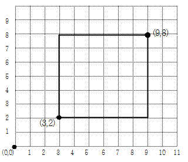
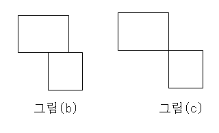
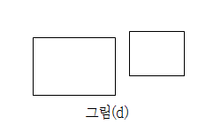
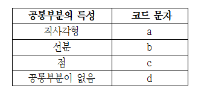

# BAEKJOON

# 2527: 직사각형

### 문제

x2차원 격자공간에 두 개의 꼭짓점 좌표로 표현되는 직사각형이 있다. 직사각형은 아래와 같이 왼쪽 아래 꼭짓점 좌표 (x, y)와 오른쪽 위 꼭짓점 좌표 (p, q)로  주어진다.  



이 문제에서 모든 직사각형은 두 꼭짓점의 좌표를 나타내는 4개의 정수 x y p q 로 표현된다. 단 항상 x<p, y<q 이다. 예를 들어 위 그림에 제시된 직사각형이라면 아래와 같이 표현된다.

​       **3 2 9 8**

두 개의 직사각형은 그 겹치는 부분의 특성에 따라 다음 4가지 경우로 분류될 수 있다. 

먼저 두 직사각형의 겹치는 부분이 직사각형인 경우이다. 아래 그림(a)는 공통부분이 직사각형인 경우의 3가지 예를 보여준다,   

.png)

또는 겹치는 부분이 아래 그림 (b)와 같이 선분이 될 수도 있고, 그림 (c)와 같이 점도 될 수 있다.  



마지막으로 아래 그림 (d)와 같이 공통부분 없이 두 직사각형이 완전히 분리된 경우도 있다.



여러분은 두 직사각형의 겹치는 부분이 직사각형인지, 선분인지, 점인지, 아니면 전혀 없는 지를 판별해서 해당되는 코드 문자를 출력해야 한다. 



### 입력

4개의 줄로 이루어져 있다. 각 줄에는  8개의 정수가 하나의 공백을 두고 나타나는데, 첫 4개의 정수는 첫 번째 직사각형을, 나머지 4개의 정수는 두 번째 직사각형을 각각 나타낸다. 단 입력 직사각형의 좌표 값은 1이상 50,000 이하의 정수로 제한된다.  


#### 1번 풀이

```python
sqaure_info = [list(map(int,input().split())) for _ in range(4)]
for i in range(4):
    x_1 = sqaure_info[i][1]
    y_1 = sqaure_info[i][0]
    p_1 = sqaure_info[i][3]
    q_1 = sqaure_info[i][2]
    x_2 = sqaure_info[i][5]
    y_2 = sqaure_info[i][4]
    p_2 = sqaure_info[i][7]
    q_2 = sqaure_info[i][6]

    if p_1 < x_2: print('d')
    elif p_1 == x_2:
        if q_1 == y_2: print('c')
        elif q_1 < y_2: print('d')
        elif q_1 > y_2:
            if y_1 < q_2: print('b')
            elif y_1 == q_2: print('c')
            elif y_1 > q_2: print('d')

    elif p_1 > x_2:
        if x_1 < p_2:
            if q_1 == y_2: print('b')
            elif q_1 < y_2: print('d')
            elif q_1 > y_2:
                if y_1 < q_2: print('a')
                elif y_1==q_2: print('b')
                elif y_1 > q_2: print('d')
        elif x_1 == p_2:
            if q_1 == y_2:
                print('c')
            elif q_1 < y_2:
                print('d')
            elif q_1 > y_2:
                if y_1 < q_2: print('b')
                elif y_1 == q_2: print('c')
                elif y_1 > q_2: print('d')
        else: print('d')
```

- 맨처음 풀때는 직접 맵을 그려 문제그대로 그림을 구현해봤더니 런타임 에러가 발생했다.
- 때문에 수학적으로 경우의 수를 나눠 위와 같이 해결해 런타임에러를 발생시키지 않고 통과할 수 있었다. 
- 수학적으로 알고리즘을 효율적으로 해결하는 중요성을 느꼈다.

### 풀이2 

```python
sqaure_info = [list(map(int,input().split())) for _ in range(4)]

for i in range(4):
    grid = [[0] * (max(sqaure_info[i]) + 1) for _ in range(max(sqaure_info[i]) + 1)]
    cnt_two = 0
    row_bool_sub = False
    row_bool = False
    for j in range(0,8,4):
        x = sqaure_info[i][j]
        y = sqaure_info[i][j+1]
        p = sqaure_info[i][j+2]
        q = sqaure_info[i][j+3]
        for a in range(x,p+1):
            for b in range(y,q+1):
                grid[a][b] += 1
    for r in range(max(sqaure_info[i]) + 1):
        if cnt_two > 0: row_bool_sub = True
        for c in range(max(sqaure_info[i]) + 1):
            if grid[r][c] == 2:
                cnt_two += 1
            if grid[r][c] == 2 and row_bool_sub:
                row_bool = True
    if row_bool_sub == False and cnt_two == 0:
        print('d')
    elif cnt_two == 1:
        print('c')
    elif row_bool_sub == True and row_bool == False:
        print('b')
    else:
        print('a')
```

- 위 풀이는 직접 맵을 해결하는 풀이이다. 답 자체는 맞지만 런타임 에러가 발생하는 문제가 있다.