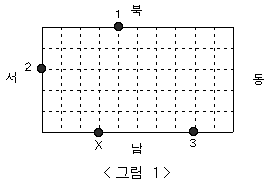

# BAEKJOON

# 2564: 경비원

### 문제

동근이는 무인 경비 회사 경비원으로 항상 대기하고 있다가 호출이 들어오면 경비차를 몰고 그 곳으로 달려가야 한다. 동근이가 담당하고 있는 곳은 직사각형 모양의 블록으로 블록 중간을 가로질러 차가 통과할만한 길이 없다. 이 블록 경계에 무인 경비를 의뢰한 상점들이 있다.

예를 들어 가로의 길이가 10, 세로의 길이가 5인 블록의 경계에 무인 경비를 의뢰한 3개의 상점이 있다고 하자. <그림 1>과 같이 이들은 1, 2, 3으로 표시되어 있고, 동근이는 X로 표시한 위치에 있다.



1번 상점에서 호출이 들어 왔을 때 동근이가 블록을 시계방향으로 돌아 이동하면 이동 거리가 12가 된다. 반면 반시계방향으로 돌아 이동하면 이동 거리는 18이 된다. 따라서 동근이가 1번 상점으로 가는 최단 거리는 12가 된다. 마찬가지로 동근이의 위치에서 2번 상점까지의 최단 거리는 6, 3번 상점까지의 최단 거리는 5가 된다.

블록의 크기와 상점의 개수 및 위치 그리고 동근이의 위치가 주어질 때 동근이의 위치와 각 상점 사이의 최단 거리의 합을 구하는 프로그램을 작성하시오.

### 입력

첫째 줄에 블록의 가로의 길이와 세로의 길이가 차례로 주어진다. 둘째 줄에 상점의 개수가 주어진다. 블록의 가로의 길이와 세로의 길이, 상점의 개수는 모두 100이하의 자연수이다. 이어 한 줄에 하나씩 상점의 위치가 주어진다. 상점의 위치는 두 개의 자연수로 표시된다. 첫째 수는 상점이 위치한 방향을 나타내는데, 1은 블록의 북쪽, 2는 블록의 남쪽, 3은 블록의 서쪽, 4는 블록의 동쪽에 상점이 있음을 의미한다. 둘째 수는 상점이 블록의 북쪽 또는 남쪽에 위치한 경우 블록의 왼쪽 경계로부터의 거리를 나타내고, 상점이 블록의 동쪽 또는 서쪽에 위치한 경우 블록의 위쪽 경계로부터의 거리를 나타낸다. 마지막 줄에는 동근이의 위치가 상점의 위치와 같은 방식으로 주어진다. 상점의 위치나 동근이의 위치는 블록의 꼭짓점이 될 수 없다.

### 출력

첫째 줄에 동근이의 위치와 각 상점 사이의 최단 거리의 합을 출력한다.

#### 풀이

```python
col, row = map(int,input().split())
stores = int(input())
village = [[0]*(col+1) for _ in range(row+1)]
for i in range(1,row):
    for j in range(1,col):
        village[i][j] = 'x'
for i in range(1,stores+2):
    direction, distance = map(int,input().split())
    if i == stores+1:
        if direction == 1:
            x, y = 0, distance
        elif direction == 2:
            x, y = row, distance
        elif direction == 3:
            x, y = distance, 0
        elif direction == 4:
            x, y = distance, col
        village[x][y] = i
    elif direction == 1:
        village[0][distance] = i
    elif direction == 2:
        village[row][distance] = i
    elif direction == 3:
        village[distance][0] = i
ans = 0
dr = [-1,0,1,0]
dc = [0,-1,0,1]
for target in range(1,stores+1):
    cnt = 0
    cnt_stack = []
    visit = [[0]*(col+1) for _ in range(row+1)]
    start_stack = []
    start_stack.append([x,y])
    while start_stack:
        r, c = start_stack.pop()
        for k in range(4):
            nr = r + dr[k]
            nc = c + dc[k]
            if 0 <= nr < row+1 and 0<= nc < col+1:
                if village[nr][nc] == target:
                    cnt_stack.append(cnt+1)
                    cnt = 0
                    start_stack.clear()
                    start_stack.append([x,y])
            if 0 <= nr < row+1 and 0<= nc < col+1 and type(village[nr][nc]) == int and village[nr][nc] != target and village[nr][nc] != stores+1 and visit[nr][nc]==0:
                start_stack.append([nr,nc])
                cnt += 1
                visit[nr][nc] = 1
                break
    ans += min(cnt_stack)
print(ans)
```

- DFS를 구현해 주어진 위치에서 각각의 상점에 양쪽 방향으로 간뒤, 더 짧은 거리를 택해주는 방식으로 코드를 구현해 봤다.
- 다만 직접 DFS를 구현하면 런타임이 너무 오래걸려, 수학적으로 풀어 더 효율적으로 프로그램을 돌리는 법을 생각해보려고 했다.
- 수학적 풀이로는 시간이 남으면 다시 풀어볼 생각이다.