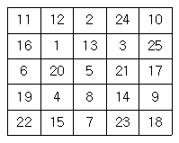
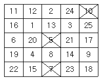
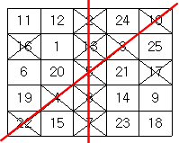
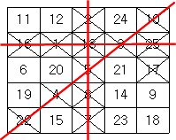

# BAEKJOON

# 2578: 빙고

### 문제

빙고 게임은 다음과 같은 방식으로 이루어진다.

먼저 아래와 같이 25개의 칸으로 이루어진 빙고판에 1부터 25까지 자연수를 한 칸에 하나씩 쓴다



다음은 사회자가 부르는 수를 차례로 지워나간다. 예를 들어 5, 10, 7이 불렸다면 이 세 수를 지운 뒤 빙고판의 모습은 다음과 같다.



차례로 수를 지워가다가 같은 가로줄, 세로줄 또는 대각선 위에 있는 5개의 모든 수가 지워지는 경우 그 줄에 선을 긋는다.



이러한 선이 세 개 이상 그어지는 순간 "빙고"라고 외치는데, 가장 먼저 외치는 사람이 게임의 승자가 된다.



철수는 친구들과 빙고 게임을 하고 있다. 철수가 빙고판에 쓴 수들과 사회자가 부르는 수의 순서가 주어질 때, 사회자가 몇 번째 수를 부른 후 철수가 "빙고"를 외치게 되는지를 출력하는 프로그램을 작성하시오.

### 입력

첫째 줄부터 다섯째 줄까지 빙고판에 쓰여진 수가 가장 위 가로줄부터 차례대로 한 줄에 다섯 개씩 빈 칸을 사이에 두고 주어진다. 여섯째 줄부터 열째 줄까지 사회자가 부르는 수가 차례대로 한 줄에 다섯 개씩 빈 칸을 사이에 두고 주어진다. 빙고판에 쓰여진 수와 사회자가 부르는 수는 각각 1부터 25까지의 수가 한 번씩 사용된다.

### 출력

첫째 줄에 사회자가 몇 번째 수를 부른 후 철수가 "빙고"를 외치게 되는지 출력한다.

#### 풀이

```python
board_me = []
board_host = []
for _ in range(5):
    board_me.append(list(map(int,input().split())))
for _ in range(5):
    board_host.append(list(map(int,input().split())))
# for row in board_me:
#     print(row)
# print()
visit = [[0]*5 for _ in range(5)]
cnt_all = 0
bool = False
for i in range(5):
    for j in range(5):
        if bool == True: break
        target = board_host[i][j]
        for a in range(5):
            for b in range(5):
                if board_me[a][b] == target:
                    visit[a][b] = 1
                    dr = [-1,1,0,0,1,-1,1,-1]
                    dc = [0,0,1,-1,1,-1,-1,1]
                    r = a
                    c = b
                    for k in range(0,8,2):
                        cnt = 1
                        nr_first = r+dr[k]
                        nc_first = c+dc[k]
                        nr_second = r + dr[k+1]
                        nc_second = c + dc[k+1]
                        while 0<=nr_first<=4 and 0<=nc_first<=4 and visit[nr_first][nc_first] == 1:
                            cnt += 1
                            nr_first = nr_first+dr[k]
                            nc_first = nc_first+dc[k]
                        while 0<=nr_second<=4 and 0<=nc_second<=4 and visit[nr_second][nc_second] == 1:
                            cnt += 1
                            nr_second = nr_second+dr[k+1]
                            nc_second = nc_second+dc[k+1]
                        if cnt == 5:
                            cnt_all+=1
                        if cnt_all == 3:
                            print(5*i+(j+1)); bool = True; break
```

- 사회자가 알려주는대로 알을 두고, 그때마다 빙고가 몇개인지 세줘 만약 빙고가 3개가 이뤄지면 빙고를 외치도록(몇번째 수인지) 코드를 구현해 줬다.