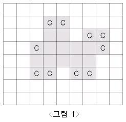
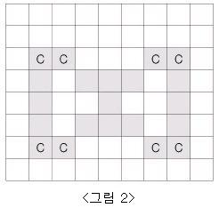
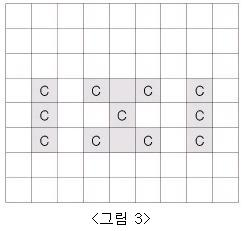

# BAEKJOON

# 2605: 줄세우기

### 문제

N×M (5≤N, M≤100)의 모눈종이 위에 아주 얇은 치즈가 <그림 1>과 같이 표시되어 있다. 단, N 은 세로 격자의 수이고, M 은 가로 격자의 수이다. 이 치즈는 냉동 보관을 해야만 하는데 실내온도에 내어놓으면 공기와 접촉하여 천천히 녹는다. 그런데 이러한 모눈종이 모양의 치즈에서 각 치즈 격자(작 은 정사각형 모양)의 4변 중에서 적어도 2변 이상이 실내온도의 공기와 접촉한 것은 정확히 한시간만에 녹아 없어져 버린다. 따라서 아래 <그림 1> 모양과 같은 치즈(회색으로 표시된 부분)라면 C로 표시된 모든 치즈 격자는 한 시간 후에 사라진다.



<그림 2>와 같이 치즈 내부에 있는 공간은 치즈 외부 공기와 접촉하지 않는 것으로 가정한다. 그러므 로 이 공간에 접촉한 치즈 격자는 녹지 않고 C로 표시된 치즈 격자만 사라진다. 그러나 한 시간 후, 이 공간으로 외부공기가 유입되면 <그림 3>에서와 같이 C로 표시된 치즈 격자들이 사라지게 된다.



모눈종이의 맨 가장자리에는 치즈가 놓이지 않는 것으로 가정한다. 입력으로 주어진 치즈가 모두 녹아 없어지는데 걸리는 정확한 시간을 구하는 프로그램을 작성하시오.

### 입력

첫째 줄에는 모눈종이의 크기를 나타내는 두 개의 정수 N, M (5≤N, M≤100)이 주어진다. 그 다음 N개의 줄에는 모눈종이 위의 격자에 치즈가 있는 부분은 1로 표시되고, 치즈가 없는 부분은 0으로 표시된다. 또한, 각 0과 1은 하나의 공백으로 분리되어 있다.

### 출력

출력으로는 주어진 치즈가 모두 녹아 없어지는데 걸리는 정확한 시간을 정수로 첫 줄에 출력한다.

#### 풀이1

```python
N, M = map(int,input().split())
cheese_map = [list(map(int,input().split())) for _ in range(N)]
hours = 0
stack = []

for a in range(N):
    for b in range(M):
        while cheese_map[a][b]:
            first_last_row = [ ]
            first_meet = 0
            for row in range(N):
                bool_last = 0
                for col in range(M):
                    if cheese_map[row][col]:
                        first_meet += 1
                        if first_meet == 1:
                            first_last_row.append(row)
                        bool_last += 1
                if bool_last == 0 and first_meet > 0:
                    first_last_row.append(row-1)
            # print(first_last_row)
            while first_last_row:
                i = first_last_row.pop(0)
                for j in range(M):
                    if cheese_map[i][j] == 1:
                        around_air = 0
                        r, c = i, j
                        dr = [-1,0,1,0]
                        dc = [0,-1,0,1]
                        for k in range(4):
                            nr = r+dr[k]
                            nc = c+dc[k]
                            if nr < 0 or nr >= N or nc < 0 or nc >= M: continue
                            elif cheese_map[nr][nc] == 0: around_air += 1
                        if around_air >= 2: stack.append([r,c])
                while stack:
                    s_r, s_c = stack.pop(0)
                    cheese_map[s_r][s_c] = 0
            hours += 1
            # for row in cheese_map:
            #     print(row)
            # print()
print(hours)
```


### 풀이 2

```python
bool = True

while bool:
    for i in range(N):
        for j in range(M):
            if cheese_map[i][j] == 1:
                around_air = 0
                r, c = i, j
                dr = [-1,0,1,0]
                dc = [0,-1,0,1]
                for k in range(4):
                    nr = r+dr[k]
                    nc = c+dc[k]
                    if nr< 0 or nr>= N or nc < 0 or nc >= M: continue
                    elif 0 <= nr+dr[k] < N and 0 <= nc+dc[k] < M:
                        if cheese_map[nr+dr[k]][nc+dc[k]] == 1: continue
                    if cheese_map[nr][nc] == 0: around_air += 1
                if around_air >= 2: stack.append([r,c])
    if stack:
        while stack:
            s_r, s_c = stack.pop(0)
            cheese_map[s_r][s_c] = 0
        hours+=1
    else:
        bool = False
    for row in cheese_map:
        print(row)
    print()
print(hours)
```

- 문제안에서 치즈가 녹는 공간(외부공간과 내부공간)을 설명하는 것이 다소 상충돼, 두 가지 방식으로 풀어냈다.
- 문제자체가 명확하지는 않아 같은 ssafy반 친구들과 여러 의견을 나누며 해결했다.

