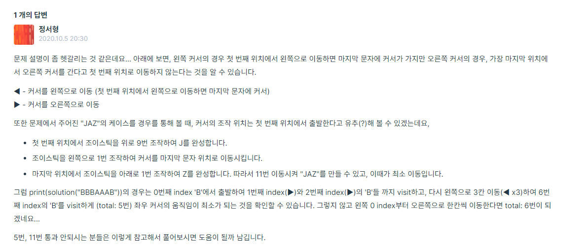

# 프로그래머스

# 조이스틱

### 일자 20210504

###### 문제 설명

조이스틱으로 알파벳 이름을 완성하세요. 맨 처음엔 A로만 이루어져 있습니다.
ex) 완성해야 하는 이름이 세 글자면 AAA, 네 글자면 AAAA

조이스틱을 각 방향으로 움직이면 아래와 같습니다.

```
▲ - 다음 알파벳
▼ - 이전 알파벳 (A에서 아래쪽으로 이동하면 Z로)
◀ - 커서를 왼쪽으로 이동 (첫 번째 위치에서 왼쪽으로 이동하면 마지막 문자에 커서)
▶ - 커서를 오른쪽으로 이동
```

예를 들어 아래의 방법으로 "JAZ"를 만들 수 있습니다.

```
- 첫 번째 위치에서 조이스틱을 위로 9번 조작하여 J를 완성합니다.
- 조이스틱을 왼쪽으로 1번 조작하여 커서를 마지막 문자 위치로 이동시킵니다.
- 마지막 위치에서 조이스틱을 아래로 1번 조작하여 Z를 완성합니다.
따라서 11번 이동시켜 "JAZ"를 만들 수 있고, 이때가 최소 이동입니다.
```

만들고자 하는 이름 name이 매개변수로 주어질 때, 이름에 대해 조이스틱 조작 횟수의 최솟값을 return 하도록 solution 함수를 만드세요.

##### 제한 사항

- name은 알파벳 대문자로만 이루어져 있습니다.
- name의 길이는 1 이상 20 이하입니다.

##### 입출력 예

| name     | return |
| -------- | ------ |
| "JEROEN" | 56     |
| "JAN"    | 23     |


### 풀이1(테스트 케이스 11 통과 불가능)

```python
def solution(name):

    
    # name을 배열로 리스트화, 길이 체크
    name = list(name); N = len(name)
    # 배열이 모두 완성되면 추가적인 칸 이동 없이 break 시켜주기 위한 check list 선언
    check = [0]*N
    # 'A'문자는 이미 완성이므로 완성으로 표시.
    for i in range(N):
        if name[i] == 'A': check[i] = 1
            
    # 처음 자리에서 부터 시작 = 처음 시작은 칸을 이동 안해도 되므로 answer -1에서 시작.(while문을 돌리며 칸이동을 카운트 해줘야 하므로)            
    if 0 in check:
        answer = -1
    # 모든 배열이 이미 A인 경우
    else:
        answer = 0
        
    # (중요) 탐욕 알고리즘(greedy Algorithm)
    # 처음 시작 위치에서 바로 다음 알파벳이 'A'라면 반대방향을 선택 -> 현재 순간의 최적의 선택이 전체 최적 결과로 이어짐.
    dir_bool = True

    if N > 1:
        if name[1] == 'A': dir_bool = False
    
    # 순방향으로 진행할 경우
    if dir_bool:
        idx = -1
        while idx < N-1:
            if 0 not in check: break
            idx += 1; answer+=1
            alpha = name[idx]
            if ord(alpha) <= ord('M'):
                answer += ord(alpha)-ord('A')
            else:
                answer += ord('Z')-ord(alpha)+1
            check[idx] = 1
    # 반대 방향으로 진행할 경우
    else:
        idx = 1
        while idx > -N+1:
            if 0 not in check: break
            idx -= 1; answer+=1
            alpha = name[idx]
            if ord(alpha) <= ord('M'):
                answer += ord(alpha)-ord('A')
            else:
                answer += ord('Z')-ord(alpha)+1
            check[idx] = 1
        
    return answer
```

- 위 코드로는 테스트 케이스 11을 지속적으로 통과를 못했다.
- 이유는 다음과 같다.
  - ​	

#### 풀이2

```python
def solution(name):
    answer, idx = 0, 0
    # 미리 알파벳 변환 최소 값을 리스트에 저장
    change = [min(ord(i)-ord('A'), ord('Z')-ord(i)+1) for i in name]
    
    while True:
        # A로 전환
        answer += change[idx]
        change[idx] = 0
        if sum(change) == 0:
            return answer
        # 좌우를 살피며 거리 계산
        left, right = 1, 1

        # 왼쪽: A인 문자가 안나올때 까지의 거리
        while change[idx-left] == 0:
            left += 1
        # 오른쪽: 동일
        while change[idx+right] == 0:
            right += 1

        # 이동할 때 사용하는 방향키 값 반영과 위치 
        # 삼항연산자: 길이가 더 짧은 쪽 방향을 택해줌.
        answer += left if left < right else right
        idx += -left if left < right else right
```


- 이 한 문제로 하루를 다 날렸다,,,ㅂㄷㅂㄷ